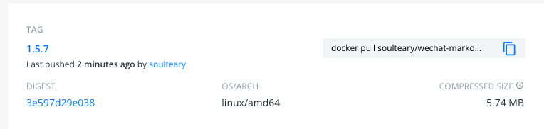
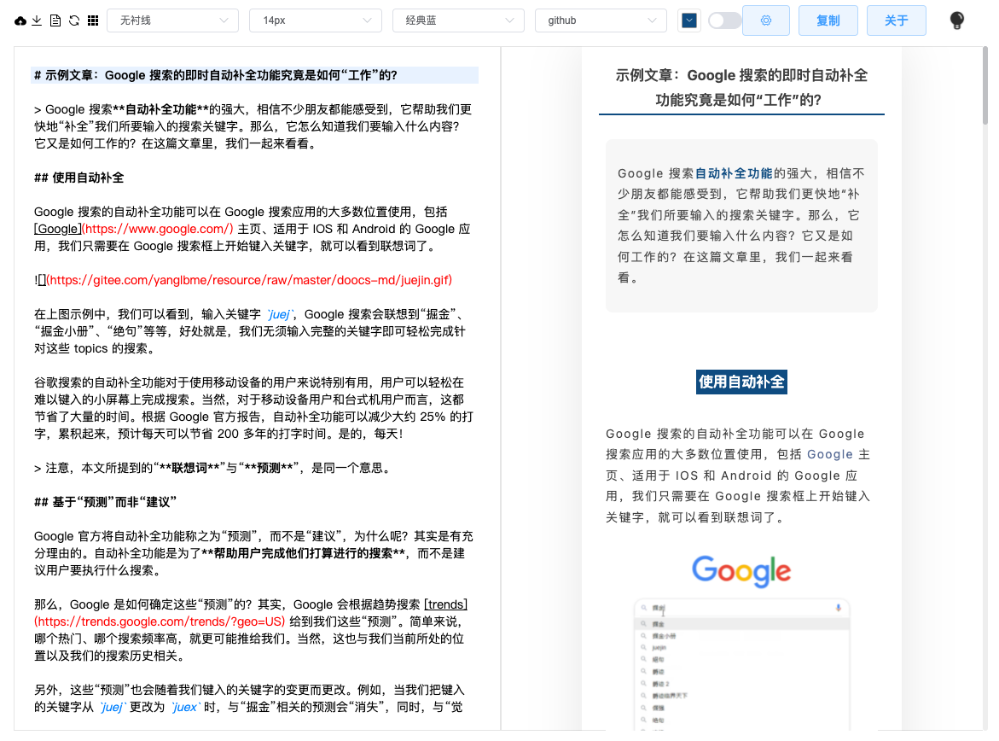

# 轻量简洁的微信编辑器 🪶

开箱即食的微信编辑器。（容器镜像大约6M）



## 使用方法

不必下载本仓库代码，如果你是 Docker 用户，可以使用一句话命令启动完全属于你的，私有化运行的实例：

```bash
docker run -d -p 8080:8080 soulteary/wechat-markdown-editor:1.5.7
```

容器运行起来之后，打开浏览器，访问 `http://localhost:8080` 就能够开始愉快的写作啦。




## 额外说明

如果你觉得这个工具好用的话，可以为这个项目点个✨，支持项目的继续迭代。

如果支持者多的话，我会考虑为不同平台适配，以及添加一些额外的使用教程。


## 致谢

感谢开源项目 [doocs/md](https://github.com/doocs/md) 和所有可爱的开源贡献者的付出。
